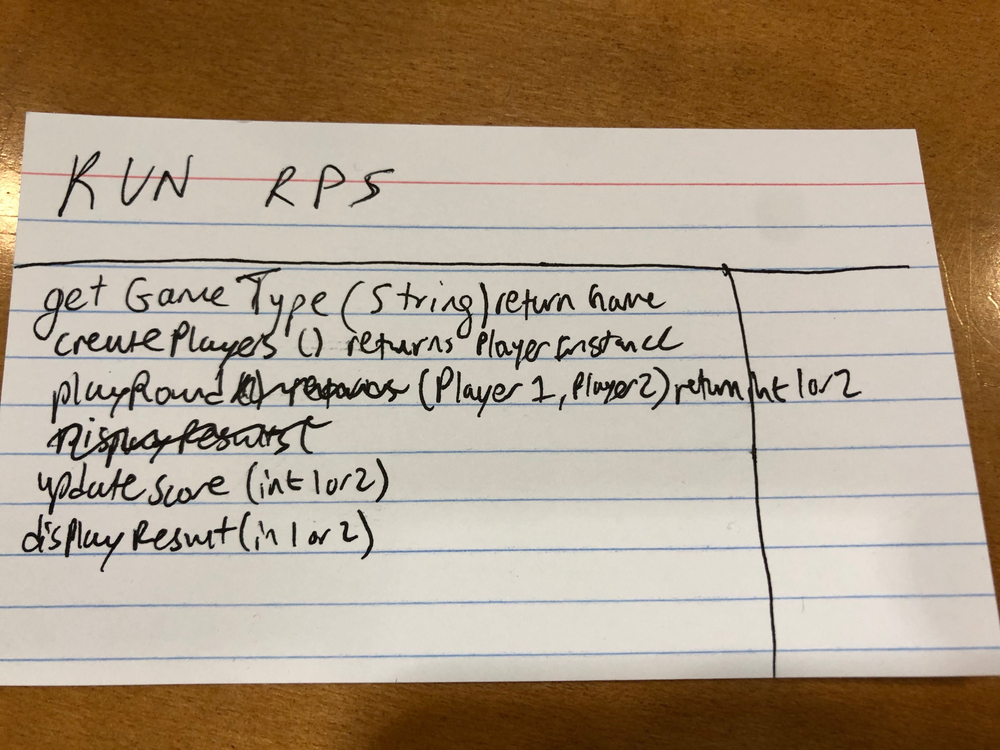
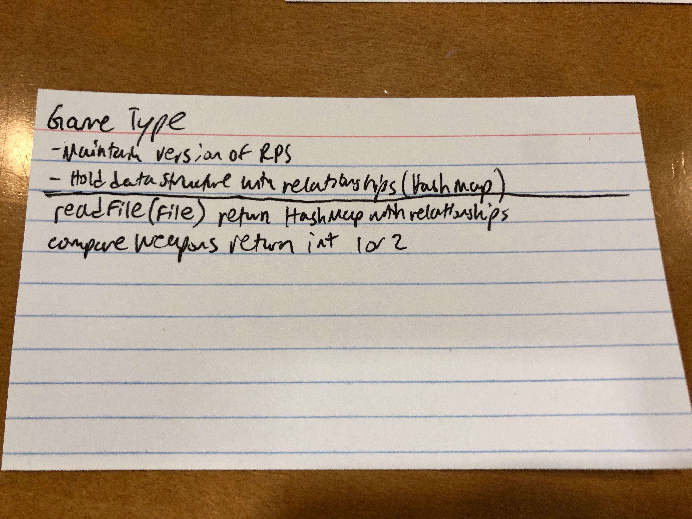
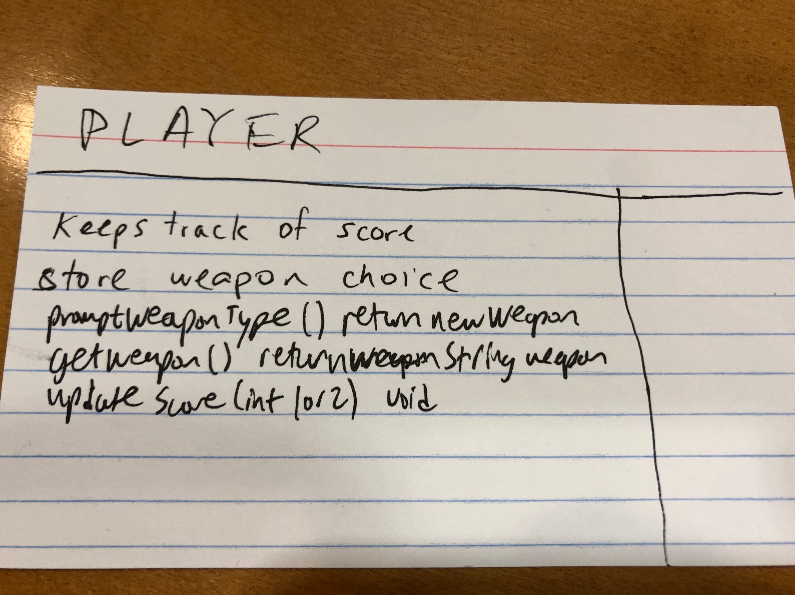
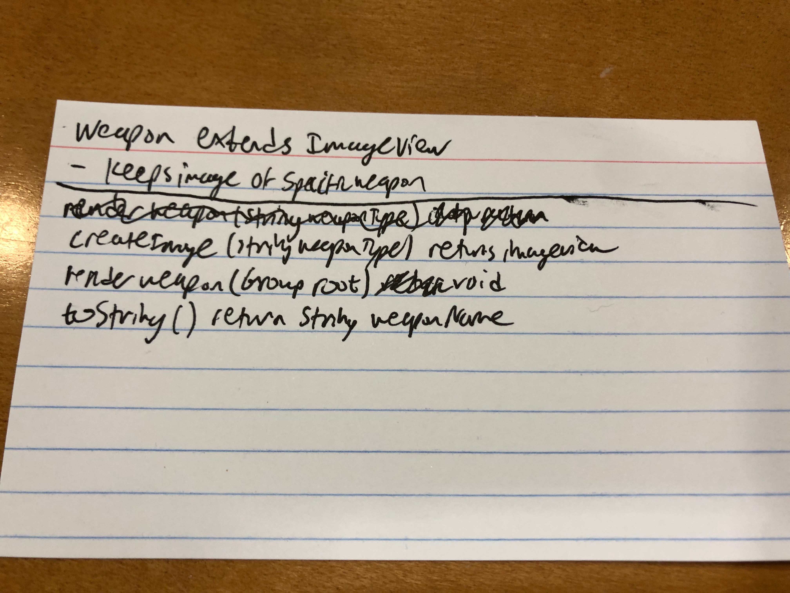
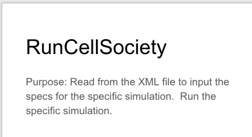
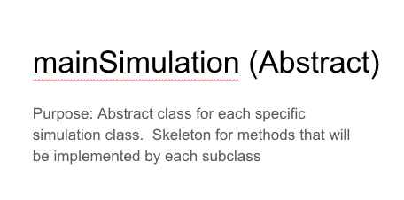
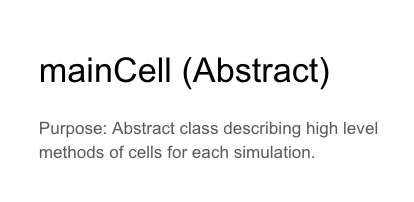

CompSci 308 Spring 2019
01/24/2019
Feroze Mohideen, Bryant Huang, Brian Jordan

RPS Design Exercise:
Created card layouts for classes that could be used in the implementation of RPS:

Cell Society Planning:
Decided on a time to meet up for a second meeting to write the project plan.
Created a Google Drive Folder to keep information about the project including a powerpoint describing the layout of the
classes and their interaction.  We also created a word document to update and use in the future as a To Do list for the
progress of our project.

Initial Images of Class Layout Slides:

